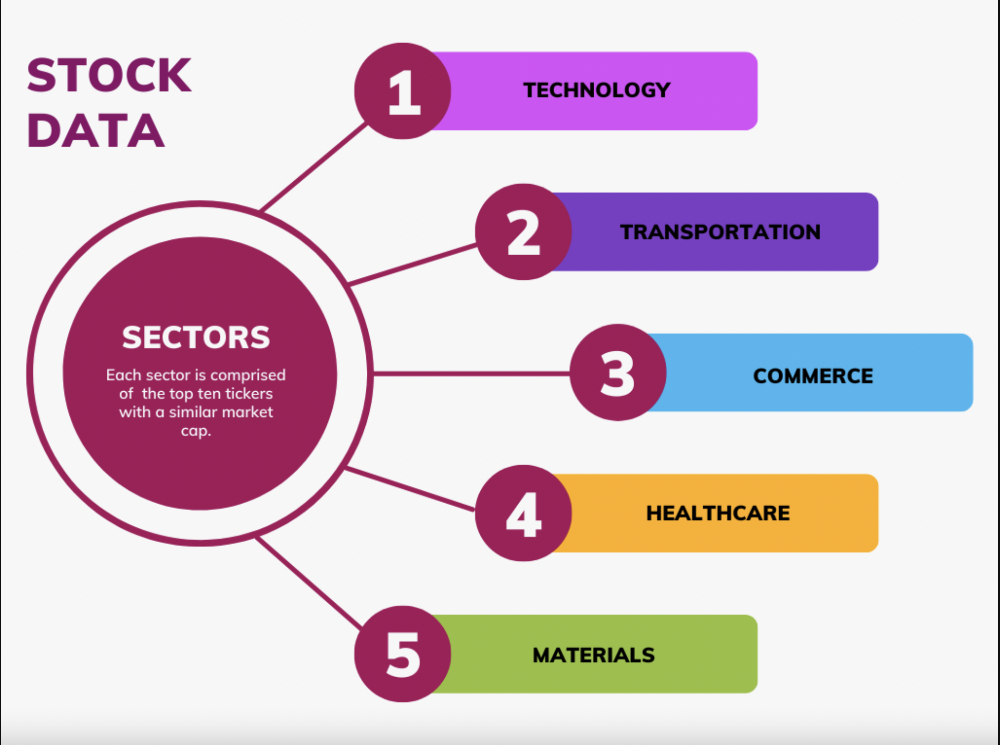
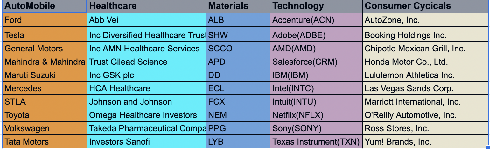
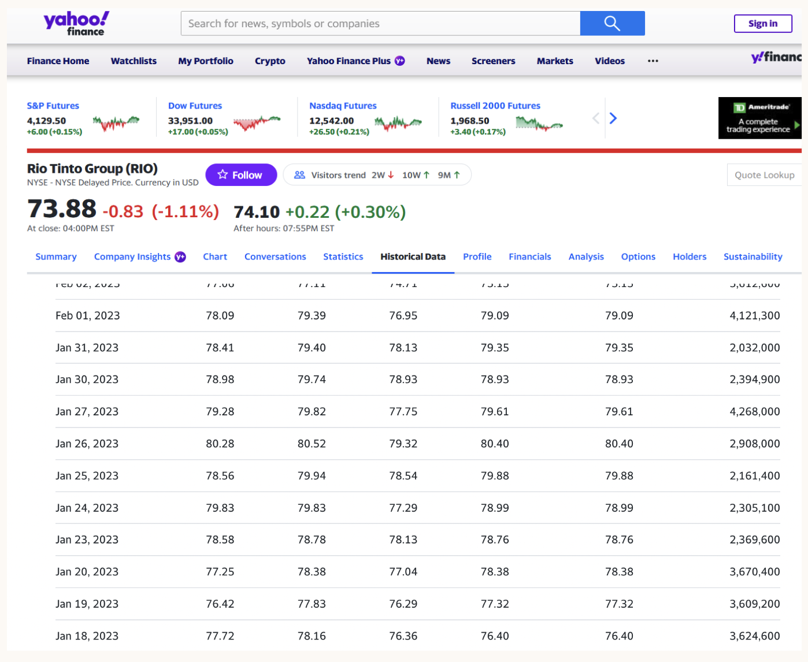
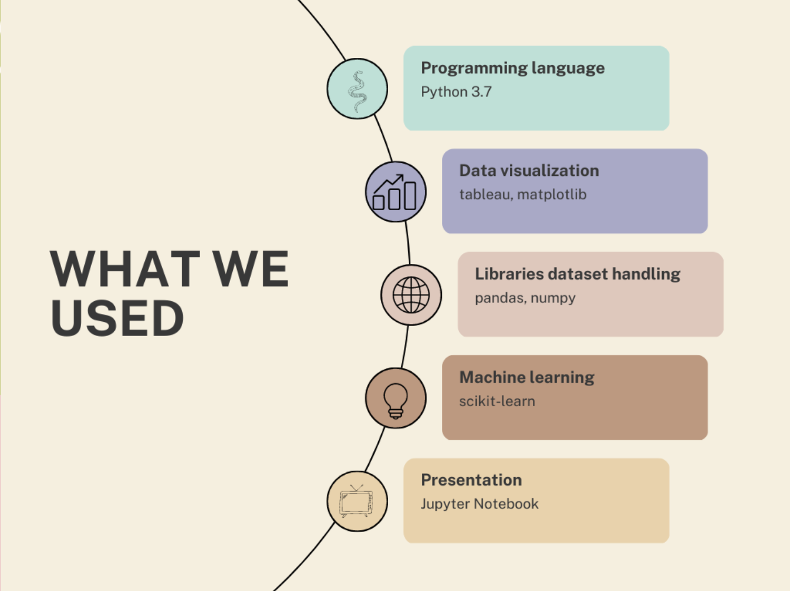
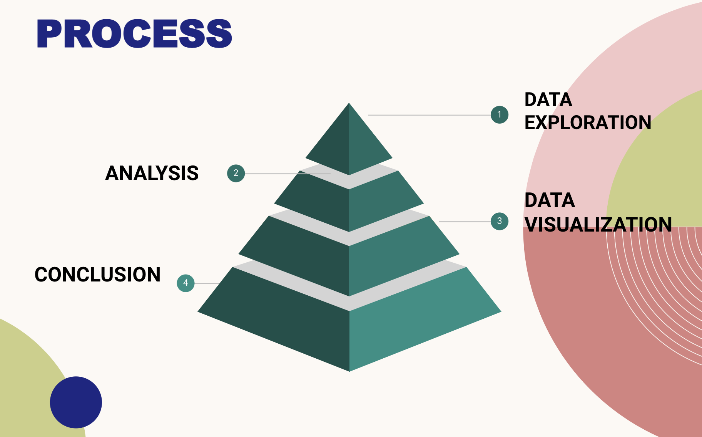
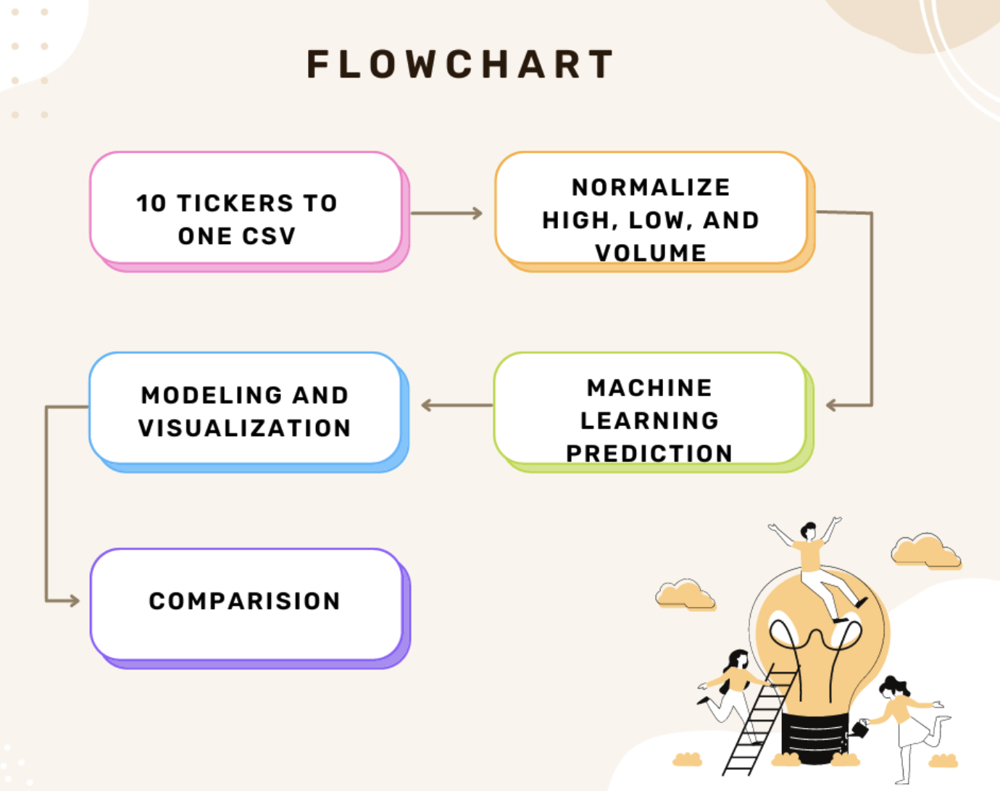
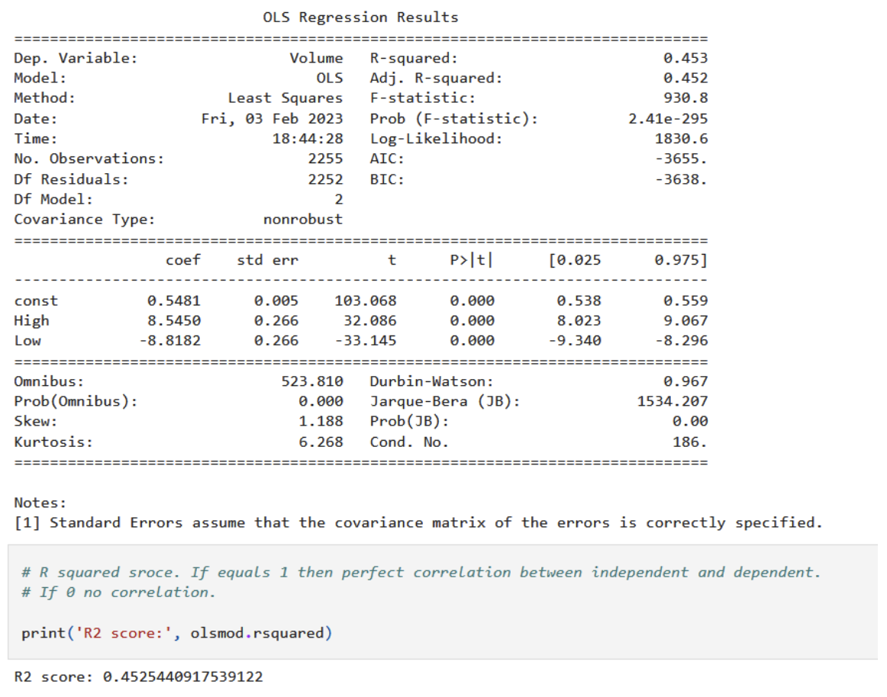
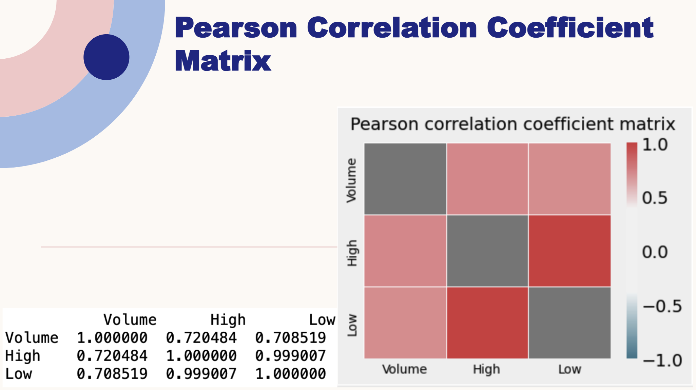
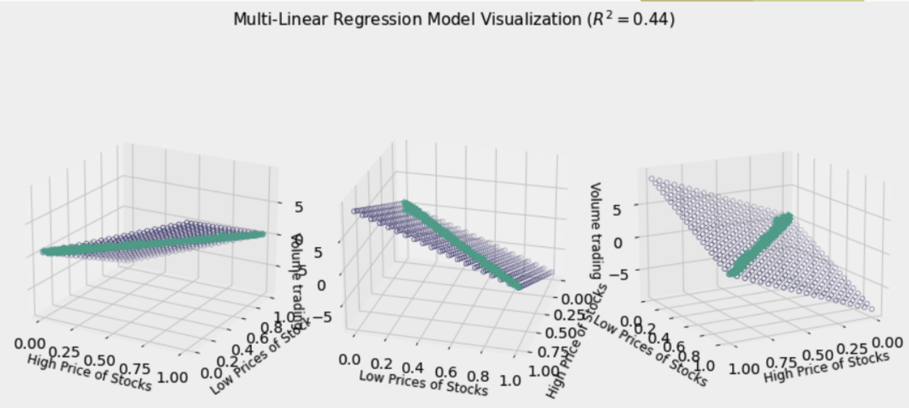

# Finance Group Project

Stock market plays a pivotal role in financial aspect of the nation's growth, but stock market is highly volatile and complex in nature. Hence, any investor would be interested in understanding the stock market overtime and how the factors mentioned above affect
the behavior of the stock market.
On Every business day, millions of traders invest in stock market. Most of these investors lose money and others gain. However, considering any trading day, loss or gain is absolutely inconsistent.
This project is focused on analyzing stocks of any given company based on statistical technical
indicators.

## Introduction
In this project our goal is to use multiple indices to show correlations between sectors and Bitcoin. We will be analyzing Stocks in two manners, internal and external correlation. 
* Internal correlation will be between different sectors and will determine if there is a correlation between high & low prices and volume trading in a span of 10 years. 
* External correlation will be between all sectors and Bitcoin(Cryptocurrency). 

Our steps for this project include attaining ten years of stock data for five sectors that include HealthCare, Technology, Automobile, Materials, Commerce, and Bitcoin. 

- Technology industry developed greatly over last decades and dramatically impact on life styles, e.g. apple watch starts to check health!
- Transportation industries refers to industries in the for-hire transportation and warehousing sector, such as air, rail, water, and truck transportation.
- Consumer Cyclical & Commerce Consumer cyclicals are a category of stocks that rely heavily on the business cycle and economic conditions. Consumer cyclicals include industries such as automotive, housing, entertainment, and retail.
- Healthcare The healthcare industry is an aggregation and integration of sectors within the economic system that provides goods and services to treat patients with curative, preventive, rehabilitative, and palliative care.
- The Materials Sector encompasses a wide range of commodity-related manufacturing industries. Included in this sector are companies that manufacture chemicals, construction materials, glass, paper, forest products and related packaging products, and metals, minerals and mining companies, including producers of steel.

For this project we used 5 different sectors i.e Automobile, Healthcare, Technology, Materials, Consumer Cycicals and Cryptocurreny (Bitcoin). Each Industry has 10 companies whoes data we have collected and are using for the analysis 

## Purpose & Goals
- To understand the effect of stock prices on trading volume for different business sectors.
- What is the correlation between stock sectors and cryptocurrency? 

## Data Sources

Data for the former sectors was obtained from Yahoo Finance in the form of CSV files.
The dataset is publicly available at https://finance.yahoo.com/.

Historical ticker data for each stock was pulled from January 2013 to January 2023. Yahoo finance provides CSV files with the date; open, high, low, close, adj_close, and volume.
Databases for these sectors were created via Python and SQL and output as CSV files.
However, as we are trying to merge multiple data sets across different sectors, it was found that the data needs to be normalized. In this case, MinMaxScaler from sklearn.preprocessing was used to normalize volume, high, and low to a set of data point between 0 and 1. This allows us to compare our large sets of data more accurately.  These databases were normalized using in MinMaxScaler from sklearn.preprocessing.

## Main tools used in this analysis
* Programming language: Python 3.7
* Libraries dataset handling: pandas, numpy
* Data visualization: tableau, matplotlib
* Machine learning: scikit-learn
* Presentation: Jupyter Notebook

## The project is divided into four stages:

Process overview as below
*	Stage 1: Data cleaning, exploration and preparation

*	Stage 2: Predictive analysis with the machine learning algorithm 

*	Stage 3: Data exploration and visualization

*	Stage 4: Conslusion and recommendations

## Results 

#### e.g. Materials 
Tickers utilized to represent the materials sector were selected based off of market cap from simplywall.st. The companies listed in the figure below all have the highest market caps in the materials sector raging from $69.6 billion to $30.2 billion.

Using yahoo finance, historical ticker data for each stock was pulled from January 18th 2013 to January 18th 2023. Yahoo finance provides CSV files with date of information; open, high, low, close, adj_close, and volume. For this project we are only interested in volume, high, and low data. Thus, SQL was used to pull and merge data from individual csv files.

## Example of results
- OLS REGRESSION AND R2 SCORE

- Pearson Correlation Coefficient Matrix

- 3D scatter Plot

## Summary & recommendations

- Based on the model, we can see that price change in stocks affects the volume trading mostly in two sectors that include Consumer and Bitcoin(Cryptocurrency)
- Technology and Healthcare sectors are the least affected by stock price changes.
- Since we have on average under 50% correlation from our predictive model, we find that outside factors also affect  the volume trading.
- As most of the R^2 of  learning model is under 50%. Thus, we conclude that the stock prices of each industry is not signaficantly related to the bitcoin price. 
- The OLS model is not "smart" enough to predict the stock prices.

Recommendations:

- For the future analysis, it's always good to compare different models, e.g. we may use the normal or lognormal distribution model for prediction.
- We may also improve the machine learning model, e.g. increasing the layers to increase the accuracy so that better predict the price trendency.
- We may try to use a supervised machine learning model such as the Random Forest Classifier combining a multitude of decision trees to predict the price and compare the accuracy.

