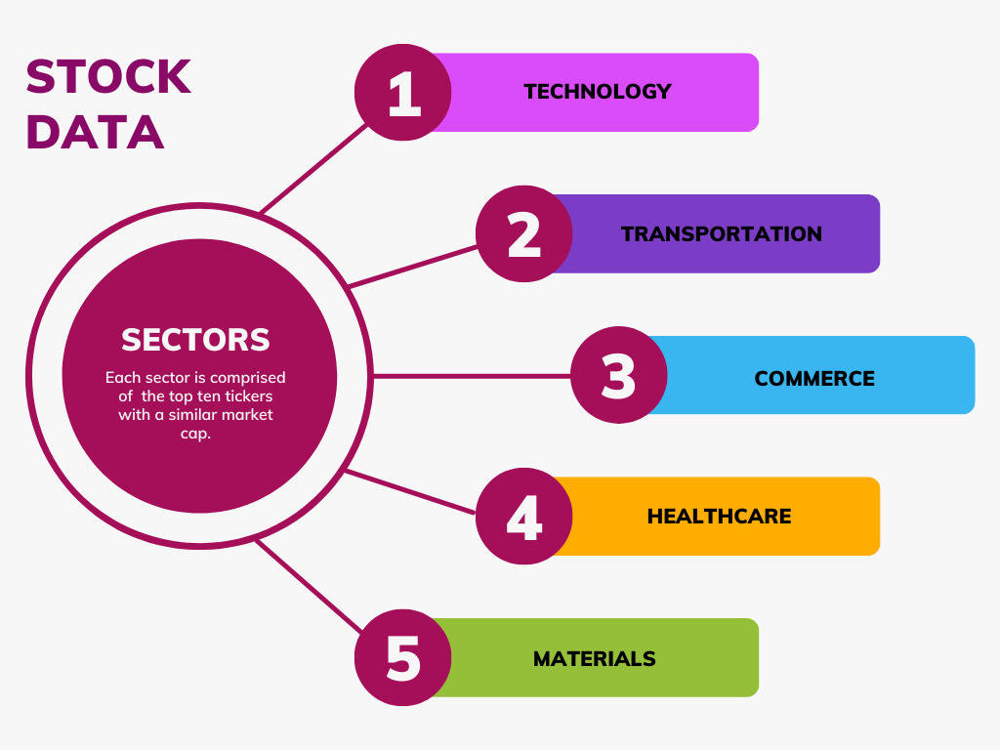
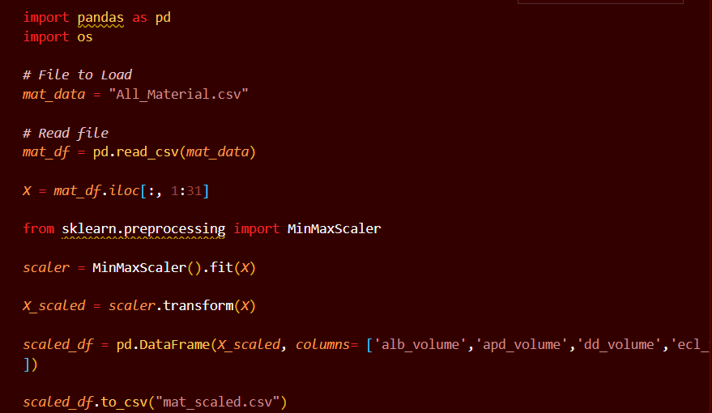

# Finance Group Project
## Intro 
In this project our goal is to use multiple indices to show correlations between sectors and Bitcoin. We will be analyzing Stocks in two manners, internal and external correlation. Internal correlation will be between different sectors and will determine if there is a correlation between high & low prices and volume trading in a span of 10 years.  External correlation will be between all sectors and Bitcoin. 

Our steps for this project include attaining ten years of stock data for five sectors that include HealthCare, Technology, Automobile, Materials, Commerce, and Bitcoin. Data for the former sectors was obtained from Yahoo Finance in the form of CSV files. Yahoo finance provides CSV files with the date; open, high, low, close, adj_close, and volume.
Databases for these sectors were created via Python and SQL and output as CSV files. These databases were normalized using in MinMaxScaler from sklearn.preprocessing.

## Tools Used
1)Programming language: Python 3.7
2) Libraries dataset handling: pandas, numpy
3) Data visualization: tableau, matplotlib
4) Machine learning: scikit-learn
5) Presentation: Jupyter Notebook

For this project we used 5 different sectors i.e Automobile, Healthcare, Technology, Materials, Consumer Cycicals and Cryptocurreny (Bitcoin). Each Industry has 10 companies whoes data we have collected and are using for the analysis 

Using yahoo finance, historical ticker data for each stock was pulled from January 2013 to January 2023. Yahoo finance provides CSV files with date of information; open, high, low, close, adj_close, and volume. For this project we are only interested in volume, high, and low data. Thus, SQL was used to pull and merge data from individual csv files.

###  The project is divided into three stages:
•	Stage 1: Data cleaning and preparation
•	Stage 2: Data exploration and visualization
•	Stage 3: Predictive analysis with the machine learning algorithm

Findings
Summary

However, as we are trying to merge multiple data sets across different sectors, it was found that the data needs to be normalized. In this case, MinMaxScaler from sklearn.preprocessing was used to normalize volume, high, and low to a set of data point between 0 and 1. This allows us to compare our large sets of data more accurately. 

### Scaler Python Code

## Results
Using yahoo finance, historical ticker data for each stock was pulled from January 18th 2013 to January 18th 2023. Yahoo finance provides CSV files with date of information; open, high, low, close, adj_close, and volume. For this project we are only interested in volume, high, and low data. Thus, Python was used to read the csv files and merge it. 
However, as we are trying to merge multiple data sets across different sectors, it was found that the data needs to be normalized. In this case, MinMaxScaler from sklearn.preprocessing was used to normalize volume, high, and low to a set of data point between 0 and 1. This allows us to compare our large sets of data more accurately.

